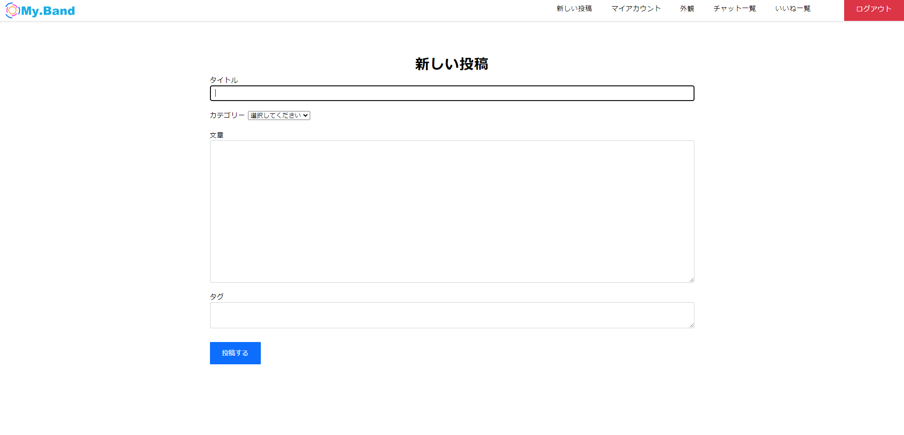
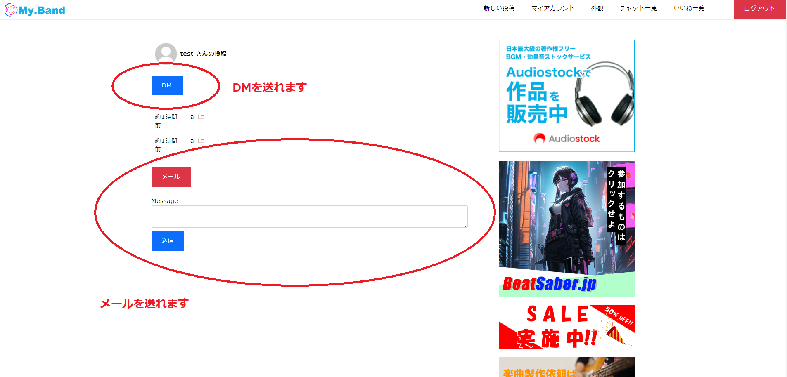
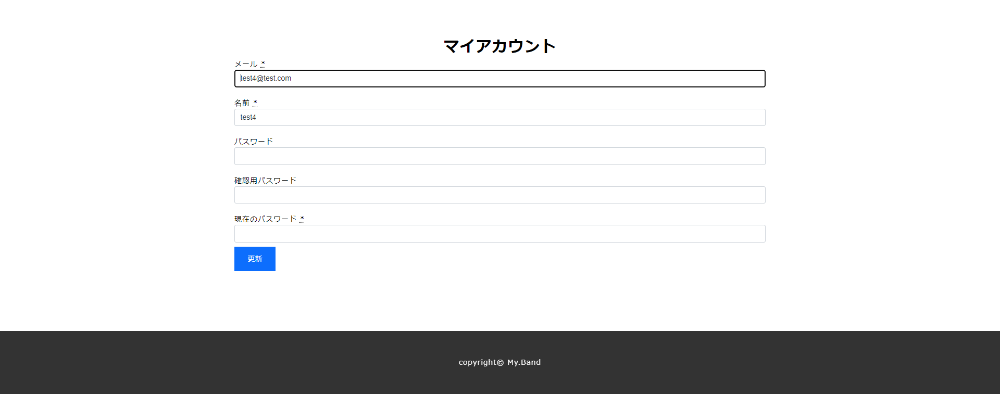
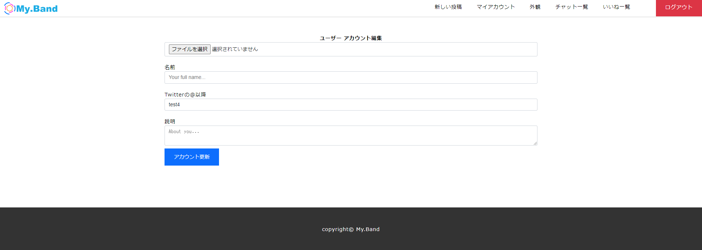

# バンドメンバーの募集サイト

## URL
https://myband.kurataaudio.net/
  
## ローカル環境のURL
http://localhost:3000/
 
  
## 概要
このWebサイトはバンドメンバーの募集を目的としたプラットフォームです。Ruby on Railsを使用して開発されています。 

## 主要な機能
- ユーザー登録とログイン
  - ユーザーはメールアドレスとパスワードを使用して登録・ログインできます
- プロフィール作成と編集
  - ユーザーは自身のプロフィールを作成・編集できます
- バンドメンバー募集の投稿
  - ユーザーはバンドメンバーを募集する投稿を作成できます 
  - 募集する楽器やジャンルなどを指定できます
- 募集への応募
  - ユーザーは興味のある募集に応募できます
  - 応募時にメッセージを添えることができます
- メッセージ交換
  - DM、メールでのやりとりができます
- 投稿へのいいね  
  - 投稿へのいいね、ができます

## 技術スタック
- Ruby on Rails
- PostgreSQL
- Heroku
- AWS S3（画像アップロード用）
- Docker
- Cloudflare
- Redis
- CI
- GitHub Actions

## セットアップ手順
1. このリポジトリをクローンします
2. `docker-compose up`を実行します
3. `http://localhost:3000/`にアクセスします

## バンドメンバー募集の投稿

- DM、メールでのやりとりができます

## バンドメンバー募集へ応募

- ユーザーはバンドメンバーを募集する投稿を作成できます 
- ジャンル、タグなどを指定できます

## アカウント情報を編集

